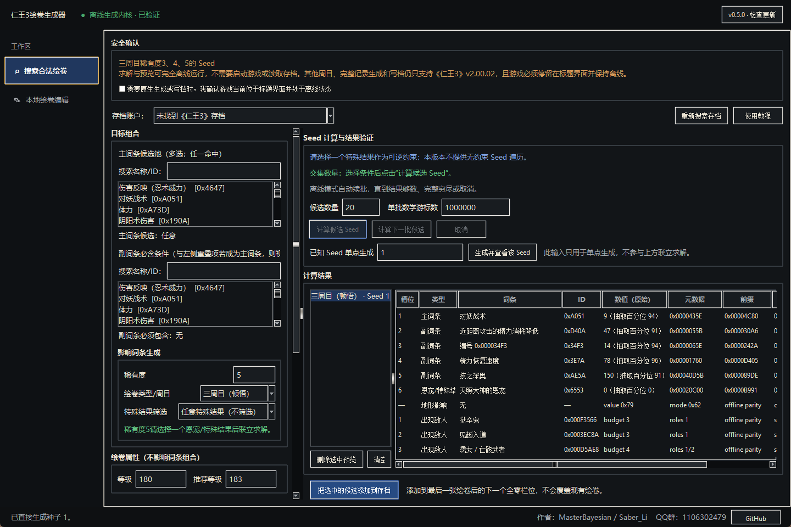

# 仁王3绘卷生成器 / Nioh 3 Scroll Generator

[简体中文](#简体中文) | [English](#english)



> 实际 Tkinter 桌面前端，截图由 Seed 1 离线生成流程产生；不是概念图。<br>
> Actual Tkinter desktop UI captured from the offline Seed 1 generation path; this is not a design mockup.

## 简体中文

`仁王3绘卷生成器` 是一款面向 PC 版《仁王3》的绘卷生成与本地编辑工具。项目将两类操作明确分开：

- **搜索合法绘卷**：根据绘卷类型、稀有度、主词条、恩宠、地形、敌人和特殊规则联立求解 Seed，再使用离线复现的游戏生成逻辑构造完整绘卷。接收方会按照相同 canonical 字段重新生成，因此这种结果具备正常传播的技术基础。
- **本地绘卷编辑**：自由修改现有绘卷的 Seed、周目、稀有度、等级、推荐等级、转手次数及七个完整词条槽；也可临时覆盖游戏进程中的敌人、地形和特殊规则。词条与头字段可写入存档，临时辅助覆盖不会保存或传播。

### 当前功能

- 中文桌面界面，包含“搜索合法绘卷”和“本地绘卷编辑”两个工作区。
- 七槽本地草稿编辑器：完整官方词条目录可同步 ID、prefix 与类别，也可逐字段输入任意 uint32；一次事务保存所有改动，不做 Seed、稀有度、冲突或槽位合法性限制。
- 指定 Seed、稀有度和绘卷类型后直接生成并预览完整绘卷。
- 在一个全局搜索框中选择最终态逐项可达词条；前 1–3 项可作为“任一命中”的主词条候选，也可不限制主词条，其余项目作为无序必需副词条。
- 每个普通词条可独立要求任意数值、抽取百分位 ≥80、≥90 或最高 100；特殊规则同样支持任意/精确原生变体。
- 联立筛选主词条候选、多个无序副词条、可选或不限制恩宠、地形、敌人及多条特殊规则，并在搜索前检查槽位、冲突组和类别容量。
- 142 个合法敌人名称按低手／中手／高手生成池档位分栏，并保留跨栏全局搜索；内置合法组合一览解释十种原生敌人组结构和“必须包含”的筛选语义。
- 候选结果边找到边显示且不会抢走当前选择；支持按主词条数值、总抽取百分位或 Seed 排序，并可多选对比。
- 三周目稀有度 3、4、5 的游戏关闭状态离线生成与精确验证；三种稀有度均保留在正式用户入口，稀有度 5 的传播用途优先级较低，但不会删除其搜索、生成和本地使用能力。
- 自动发现 Steam 存档，不在界面或报告中写死用户目录。
- 新增、修改、删除和恢复前自动备份；写档采用源文件哈希门禁、校验和修复、加密回读验证。
- 自动备份浏览、恢复、移入 Windows 回收站，以及打开备份/存档目录。
- 完整词条组合可使用 AMD、NVIDIA 或 Intel 的 Direct3D 11 Compute 预像快路径；CUDA 继续批量预筛 Seed、主词条、地形和完整敌人路径，没有兼容 GPU 时自动回退到原生 CPU。所有路径仍由 CPU 精确重放完整记录。
- 自动发现游戏 EXE 并验证 PC v2.00.02 文件版本；明确检测到未验证的新游戏版本时拒绝用旧离线数据生成，等待应用更新。
- 签名自动更新已启用：默认仅接收正式版，用户可主动选择 Beta；两条通道都只接受官方 Ed25519 签名清单，并复核 EXE 的 SHA-256、精确大小和发布版本。

### 运行源码

要求：Windows、Python 3.12、PC v2.00.02 存档。

```powershell
py -3.12 -m pip install -r requirements.txt
py -3.12 launch_editor.py
```

构建 Windows 单文件版本：

```powershell
py -3.12 -m pip install -r requirements-dev.txt
py -3.12 -m PyInstaller --clean --noconfirm packaging\Nioh3ScrollGenerator.spec
```

程序只会在用户主动执行添加、编辑、删除或恢复时修改存档。执行前请回到标题界面并保留 Steam Cloud 的独立恢复点。

### 验收边界

本地显示正常、校验和正确或离线字节一致，都不能单独证明绘卷可传播。最终传播验收仍要求第二账号通过正常联机流程实际收到 canonical 绘卷。稀有度 3、4、5 均保留在产品中并使用完整离线生成复核；稀有度 5 的传播价值可能随游戏开发方后续修复而变化，但这不是删除本地生成与研究能力的理由。

### 逆向知识库

版本化的生成算法、Seed 求解边界、敌人 role 表、等级语义、存档与传播协议，以及三语原生编号目录统一从 [工程知识库](docs/knowledge/INDEX.md) 进入；玩家可直接查看 [敌人组合速查表](docs/knowledge/versions/pc-v2.00.02/catalogs/enemy-combinations.md)。知识库会明确区分原生字节一致、控制流证据、实机观察、推断和未知项，旧版本结论不会静默覆盖新版本。

### 作者与联系

- 作者：**MasterBayesian & Saber_Li**
- QQ 群：**1106302479**
- GitHub：[Master-Bayesian/Nioh3-Scroll-Generator](https://github.com/Master-Bayesian/Nioh3-Scroll-Generator)

本仓库不会提交用户存档、Steam ID、游戏 `.text/.rdata/.pdata` 原始转储、动态调试捕获或更新签名私钥。

项目自身的开源许可证尚待两位作者共同确定。在正式许可证发布前，公开源码仅供查看与协作研究，不代表自动授予再分发许可。第三方组件声明见 [THIRD_PARTY_NOTICES.md](THIRD_PARTY_NOTICES.md)。

## English

This repository contains the source for `Nioh 3 Scroll Generator`, a Windows desktop application for canonical scroll generation and guarded local save editing.

Authors: **MasterBayesian & Saber_Li**<br>
Contact: QQ group **1106302479**<br>
GitHub: [Master-Bayesian/Nioh3-Scroll-Generator](https://github.com/Master-Bayesian/Nioh3-Scroll-Generator)

The project's own open-source license is still pending a joint author decision.
Public source visibility does not grant redistribution rights by itself. See
[THIRD_PARTY_NOTICES.md](THIRD_PARTY_NOTICES.md) for bundled third-party terms.

This repository contains two deliberately separated Nioh 3 workflows. The canonical generator solves Seeds and builds records that remain eligible for normal in-game propagation. The local editor can directly change visible effect fields for personal use, but those edits are explicitly marked non-propagating because recipients rebuild effects from the canonical tuple.

The propagation protocol and required save fields are mapped for PC v2.00.02. Recipient-side effects are generated from the canonical item type, rarity, and random seed; visible effect slots are not transmitted. The generator therefore solves RNG constraints and reconstructs canonical game output instead of writing selected effect IDs directly. Contexts not yet reproduced offline still use the native game generator as an oracle.

The acceptance test is intentionally strict: a second account must obtain the produced scroll through the normal in-game propagation path. Loading it on the edited account is only an offline validity check.

Versioned reverse-engineering conclusions, Seed-solving boundaries, enemy role
tables, level semantics, save/network formats, and trilingual native-key
catalogs are indexed in the [engineering knowledge base](docs/knowledge/INDEX.md),
with a direct [player enemy-combination guide](docs/knowledge/versions/pc-v2.00.02/catalogs/enemy-combinations.md).

### Run from source

```powershell
py -3.12 -m pip install -r requirements.txt
py -3.12 launch_editor.py
```

Build the Windows single-file executable with:

```powershell
py -3.12 -m pip install -r requirements-dev.txt
py -3.12 -m PyInstaller --clean --noconfirm packaging\Nioh3ScrollGenerator.spec
```

## Application

The Chinese beta is named `仁王3绘卷生成器`. Its effect selector is derived from captured native final-effect tables for the current playthrough and rarity rather than a hand-maintained list. The first one to three ordered selections can form an OR-set of primary candidates, or the primary can remain unconstrained; later selections are unordered required secondaries. Every selected ordinary effect can require any roll, percentile 80+, percentile 90+, or the exact maximum. The solver preflights slot count, conflict groups, and category capacity before opening a Seed family. It also supports an optional exact Grace filter, multi-select exact-value special rules, direct generation from a supplied Seed, stable streaming previews, sortable and side-by-side candidate comparison, and guarded insertion into the next fully zeroed slot. Save discovery is automatic. The product UI contains no numeric seed-range scan.

The application has two explicit product areas. `搜索合法绘卷` solves or directly generates canonical records from scroll type, rarity, and Seed, so recipient-side regeneration remains consistent. Its 142 legal enemy identities are separated into Low, Middle, and High native generation-pool tiers with a global cross-tier search and a read-only guide to the ten legal enemy-group structures. `本地绘卷编辑` exposes the canonical Seed/header fields and all seven physical effect slots as one draft and can directly edit every ID, value, prefix, metadata, and tail field or clear whole records. It intentionally permits duplicate or conflicting effects, primary/secondary role mixing, unknown IDs, arbitrary uint32 values, and combinations unrelated to the canonical Seed or rarity. An experimental PC v2.00.02 runtime override can temporarily replace grouped enemies, terrain, and ordered special rules, including deliberately illegal repeated enemies; those auxiliary overrides revert when stopped or regenerated and are never presented as saved or propagating data. Batch editing and deletion use the same automatic-backup, exact-original, checksum, encryption-roundtrip, and source-hash transaction gates as canonical installation.

The local editor also includes an automatic-backup browser. It lists the account, operation reason, file count, and recorded main-save SHA-256; restores always checkpoint the current main, game-backup, and system-save files first. Application-owned backup directories can be moved to the Windows recycle bin, and both the backup and current save directories have explicit open-folder actions.

The signed update channel is active. Stable is the default and uses GitHub's latest non-prerelease Release. Users may opt into Beta in the application header; that channel compares the newest GitHub prerelease with the newest stable release and offers whichever signed semantic version is newer. Every path accepts only an HTTPS release manifest authenticated by the embedded Ed25519 public key, validates the signed asset name, size, and SHA-256, and replaces only the running executable named by an application-owned managed-install marker in the same directory. It waits for active generation or save transactions before offering restart. The signing private key is stored only as a GitHub Actions secret; no unsigned fallback exists.

Playthrough selection uses the recovered record type instead of the failed synthetic progression-selector wrapper: playthrough 1 is `0x1E82`, playthrough 2 is `0x516D`, playthrough 3 is `0xE604`, and the latent playthrough 4/5 types are `0xDD82`/`0xD523`. Playthroughs 4 and 5 are not accessible in PC v2.00.02 and are expected to arrive with DLC2. Their selectors remain read-only research options: forced native output proves that latent contexts exist, not that the eventual DLC algorithms or protocol will be identical.

Native record materialization outside certified contexts requires Nioh 3 v2.00.02 to remain at the title screen. The application checks the generator machine-code signature before calling it. NG3 rarities 3, 4, and 5 have game-closed effect and auxiliary generators that do not read a save or connect to the game. The parity corpus includes 10,000 deterministic random-Seed comparisons for each supported effect path with zero stable-record mismatches. Latent NG4/NG5 record types remain research contexts until DLC2 behavior is available. The UI binds certified NG3 previews to the current save template and allocates a fresh save-wide item-instance key only when the user requests installation. Save installation creates a backup, repairs existing strict item-key collisions, repairs the checksum, performs an encryption/decryption roundtrip, and refuses installation if the live save changes during preparation.

### NG3 rarity-3/4/5 game-closed effect and auxiliary solver

The verified PC v2.00.02 NG3 rarity-5 path starts from the exact first-draw
Grace inverse family. Rarity 3 and 4 enumerate the complete natural-Seed
mathematical family in bounded chunks and use an exact CUDA/CPU primary-effect
prefilter. Every surviving complete 32-bit Seed is replayed through the recovered
native effect path, including promotion selection, weighted candidate pools,
conflict checks, category capacities, retries, rarity rolls, R4 finalization,
and normalized slot ordering. Primary and unordered secondary constraints are
checked against that exact replay. Terrain, ordered enemies, and ordered special
rules are generated and filtered by their independent offline path.

The older conditioned primary map is no longer treated as an exact draw-2
constraint. It stored only one low-16 representative for each high-16 bucket,
but primary output can differ inside the same bucket. Natural Seeds `255766105`
and `264410626` are a regression vector: both share draw-2 high16 `0` and Grace
`0x6553`, while their primary effects are `0x512D` and `0x23E8` respectively.

The game-closed solver supports primary, multiple required secondary, terrain,
enemy, and special-rule constraints without a running game or save. Rarity 5
supports either an exact Grace constraint or an unconstrained Grace slot.
Rarity 4 can also constrain a Grace: its stage-one slot 5 starts with a Grace
candidate, then exact finalizer replay accepts only records where that Grace
survives instead of being replaced by an ordinary completed effect.
Rarity-4 execution applies the exact CUDA/CPU primary prefilter and cheap
auxiliary filters before invoking the full finalizer whenever that ordering is
semantically safe. Cumulative intersection counts are reported in the actual
optimized filter order. On the controlled Grace `0x71F6` + primary `0xB613` +
secondary `0x23E8` benchmark, six exact results dropped from roughly 15 seconds
to 0.88 seconds on the development machine without changing accepted records.
The recovered RVA `0x571478` value formula and canonical slot serialization are
also evaluated from the captured tables. The final certification corpus contains
10,000 deterministic natural Seeds for every certified rarity. Rarity 3 and 4
produced zero stable-record mismatches; rarity 5 produced zero full-record byte
mismatches. The UI can install these NG3 rarity-3/4/5 results after binding
current-save lineage and a new internal serial.
This local/native gate does not replace second-account propagation acceptance.

When `bin/nioh3_seed_accelerator.dll` is present, pivot-family construction,
natural-ID filtering, and exact NG3 primary-effect batches run through CUDA on
supported NVIDIA hardware and fall back to native CPU code otherwise. Pivot
calls are hard-chunked to at most 1,000,000 mathematical trials and primary
calls to 65,536 surviving Seeds so no full candidate family is materialized in
memory. Exact effect and auxiliary replay remains the final acceptance filter,
so acceleration cannot admit an unverified candidate.

See `research/EFFECT_SEED_SOLVER.md` for usage and acceptance boundaries.

### Resolved 0xFBEE mapping

The supplied final NG3 save records show that the earlier global mapping
`0xFBEE = 武之深奥` was an evidence-pairing error, not a slot-offset parser
error. In the final records:

```text
0xFBEE = 防御精力消耗降低 (numeric values 53..57)
0xDFF0 = 武之深奥
0x23E8 = 刚之深奥
```

Seed 210435635, reported in game as 刚之深奥, contains `0x23E8` in the supplied
final record and no `0xFBEE`. The audit evidence is in
`audit/effect_mapping/20260827_fbee_resolution.json`.

### `0xBABD` final effect versus stage-one result code

Direct final-record placement of `0xBABD` displayed `月读的恩宠` in physical
effect slots 4, 5, and 6. That local-display evidence remains valid, but it did
not prove that every occurrence of the same number was already a final effect.

Seed 183696634 supplied the missing stage transition. The installed rarity-4
stage-one record contained slot-5 `0xBABD` with a zero value. After the game
resolved the scroll, the same saved record contained the complete slot
`0xAE5A` / `技之深奥`; the first four effects were unchanged. The application
had incorrectly presented the stage-one number as a final named effect.

The catalog key must therefore include generation stage in addition to record
type, rarity, slot role/index, and the complete 0x18-byte slot payload. Rarity-4
stage-one slot-5 values remain contextual intermediate tokens in research
captures. Product previews now run the recovered finalizer and display only the
resulting final effects.

Evidence is retained under
`audit/effect_mapping/babd_manual_capture_20260827/` and
`audit/effect_mapping/babd_seed_183696634_resolution_20260827/`.

### Rarity-4 finalizer and rarity-3 growth slot

The full R4 completion loop and finalizer are now reproduced offline. It tries
candidate indexes in native order, derives a scoped RNG stream from the complete
stage-one record and target index, applies category, conflict, quota, retry,
weight, value, and normalization logic, and accepts the first candidate carrying
the native completion flag. The historical 65,536-bucket R4 stage-one map is
retained only as research evidence; product solving never interprets its slot-5
token as a final named effect.

Rarity 3 is generated through its own native path. Its last slot is the fixed
growth token `0x00000001` (`未完成的杰作 / 画龙点睛`) and is excluded from
ordinary secondary-effect matching. The former same-Seed R4 shadow prediction
path is retired.

## Research tools

`scroll_lab.py` uses only the Python standard library.

```powershell
python scroll_lab.py snapshot <SAVEDATA.BIN> captures before_obtain_scroll
python scroll_lab.py diff before.bin after.bin --max-gap 0x20 --output diff.json
python scroll_lab.py scan-records decrypted.bin --record-size 0xF0 --start 0x200000 --end 0x340000

python scroll_lab.py experiment-create experiments/first-scroll --game-version 2.00.02
python scroll_lab.py experiment-capture decr_before.bin experiments/first-scroll source_before_obtain --account source
python scroll_lab.py experiment-capture decr_after.bin experiments/first-scroll source_after_obtain --account source
python scroll_lab.py experiment-analyze experiments/first-scroll --output experiments/first-scroll/analysis.json

python scroll_lab.py catalog "Nioh 3 CHEAT TABLE V2.00.02.CT" --output effects.json
python scroll_lab.py parse-scroll decrypted.bin --offset 0x176DB6 --catalog "Nioh 3 CHEAT TABLE V2.00.02.CT"
python scroll_lab.py transplant-effect decrypted.bin candidate.bin --destination-record 0x176CCE --donor-record 0x176DB6 --destination-slot 1 --donor-slot 1 --report transplant.json
python scroll_lab.py prepare-encryption candidate.bin encryption-input.bin
```

The snapshot and experiment capture commands refuse to run while `Nioh3.exe` is active. Keep Steam Cloud disabled during experiments and never replace a live save without a separate verified backup.

`experiment-capture` accepts only decrypted Nioh 3 user data beginning with the `RNNUSR` header. The older `NIOH` marker belongs to the legacy format and is not accepted as Nioh 3 evidence. Encrypted `SAVEDATA.BIN` files must still be backed up, but byte-level differences between encrypted files are not useful for record mapping.

## Required controlled captures

The cleanest mapping sequence uses a source account that has never owned a scroll:

1. Exit the game before obtaining the first scroll. Preserve and hash both the original and decrypted save as `source_before_obtain`.
2. Obtain exactly one naturally generated scroll. Do not open, reroll, lock, equip, or delete anything else.
3. Exit the game and capture `source_after_obtain`.
4. Change exactly one rerollable effect through normal gameplay, then capture `source_after_reroll`.
5. On a second account, capture `recipient_before_receive`.
6. Propagate the unmodified control scroll through normal gameplay and capture `recipient_after_receive` immediately after it is obtained.

The recipient before/after pair is required. A source-only capture cannot prove that a locally valid record contains the server-facing identity and eligibility metadata needed for propagation.

After the natural-scroll layout and identity fields are mapped, repeat the recipient test with a minimally edited copy. Only then should the project expose a writer or GUI.

## Current status

- Safe snapshot, hashing, byte-range diff, record-run scanning, and `0xE8` scroll parsing are implemented.
- Controlled experiment creation, capture integrity checks, and staged analysis are implemented.
- Scroll ID (`+0x20`), transfer count (`+0xDC`), and seven `0x18` effect slots beginning at `+0x34` are mapped.
- The visible effect ID is at effect-slot `+0x04`; value and derived metadata occupy other fields in the same slot.
- Direct effect-slot transplants are locally valid but do not propagate. The recipient regenerates canonical effects from the seed and packed item fields.
- NG3 rarity-3, rarity-4 final, and rarity-5 records are generated game-closed from recovered v2.00.02 logic.
- Complete current-NG3 rarity-5 records added to previously empty slots have passed normal second-account propagation tests. Rarity 3 and 4 have native parity certification but still require second-account propagation acceptance.
- Scroll rarity values 0, 1, and 2 are not separate native scroll tiers in this context. Live isolated calls with all three values were normalized to rarity 3 and produced the same canonical rarity-3 records. The product therefore exposes only rarities 3, 4, and 5.
- The beta GUI returns configurable batches of matching Seeds, preserves earlier candidates for raw-value comparison, and resumes from an exact mathematical cursor; it exposes no ordinary numeric range-scan controls.
- Playthroughs 1 and 2 invert the primary effect at draw 1 using their authentic `0x1E82`/`0x516D` templates.
- Playthrough 3 uses the authentic `0xE604` template and can jointly constrain Grace draw 1 plus primary draw 2.
- Playthroughs 4 and 5 are unreleased DLC2 contexts in v2.00.02. The research path can force latent `0xDD82`/`0xD523` generation, persist a complete Grace map under an exact save-context fingerprint, and reuse it for game-closed previews. It is deliberately non-installable; current output cannot be treated as a promise about the eventual DLC implementation.
- Rarity-5 NG3 searches invert the exact Grace family. Rarity 3 and 4 construct the complete natural-Seed family in bounded chunks with a CUDA/CPU primary prefilter. All three rarities replay the complete recovered effect-selection path before accepting primary and secondary constraints.
- The same game-closed path filters exact terrain, ordered enemies, and ordered special rules. Structurally impossible enemy combinations are rejected before Seed work begins.
- NG3 rarity-3 and rarity-4 generation each passed 10,000 live-native random-Seed vectors with zero stable-record differences; rarity 5 passed 10,000 vectors with zero full-`0xE8` differences. Installation binds the current save template and next internal serial under an automatic-backup and source-hash gate.
